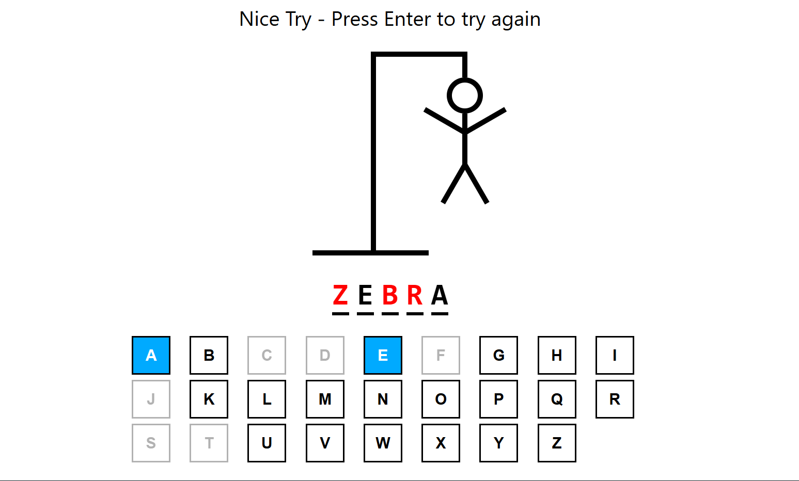

# React Hangman Game
 
A classic Hangman word guessing game built with React and TypeScript. Test your vocabulary skills by guessing the hidden word one letter at a time!



## Features

- **200+ Words**: Extensive word list with varying difficulty levels
- **Interactive Keyboard**: Click on letters or use your physical keyboard
- **Visual Hangman Drawing**: Progressive drawing as you make incorrect guesses
- **Real-time Feedback**: Immediate visual feedback for correct and incorrect guesses
- **Game States**: Clear win/lose conditions with restart functionality
- **Responsive Design**: Optimized for full-screen gameplay
- **TypeScript**: Type-safe development for better code quality

## How to Play

1. A random word is selected from the word list
2. Guess letters by clicking on the on-screen keyboard or typing on your keyboard
3. Correct guesses reveal the letter in the word
4. Incorrect guesses add a body part to the hangman drawing
5. Win by guessing all letters before the drawing is complete (6 wrong guesses)
6. Press **Enter** to start a new game

## Technologies Used

- **React 18** - Frontend framework
- **TypeScript** - Type safety and better development experience
- **Vite** - Fast build tool and development server
- **CSS Modules** - Scoped styling for components
- **React Hooks** - useState, useEffect, useCallback for state management

## Project Structure

```
src/
├── App.tsx                 # Main game component
├── HangmanDrawing.tsx      # Hangman figure drawing component
├── HangmanWord.tsx         # Word display with guessed letters
├── Keyboard.tsx            # Interactive keyboard component
├── Keyboard.module.css     # Keyboard styling
├── wordList.json          # 200+ words for the game
├── main.tsx               # App entry point
└── index.css              # Global styles
```

## Game Components

### App.tsx

- Main game logic and state management
- Handles win/lose conditions
- Manages keyboard event listeners
- Coordinates all child components

### HangmanDrawing.tsx

- Renders the hangman gallows and figure
- Progressive drawing based on incorrect guesses
- Responsive SVG-like drawing with CSS

### HangmanWord.tsx

- Displays the word with guessed letters revealed
- Shows incorrect letters in red when game is lost
- Responsive letter spacing and sizing

### Keyboard.tsx

- Interactive A-Z keyboard
- Visual feedback for guessed letters
- Disabled state for used letters and game end

## Game Rules

- **6 Lives**: You have 6 incorrect guesses before losing
- **Case Insensitive**: Type in lowercase, game handles uppercase conversion
- **No Repeats**: Can't guess the same letter twice
- **Instant Feedback**: Letters are immediately marked as correct/incorrect
- **Auto Restart**: Press Enter to play again after winning or losing

## Installation & Setup

1. Clone the repository:

```bash
git clone <repository-url>
cd hangman-game
```

2. Install dependencies:

```bash
npm install
```

3. Start the development server:

```bash
npm run dev
```

4. Open your browser and navigate to `http://localhost:5173`

## Styling Features

- **Responsive Design**: Adapts to different screen sizes
- **Visual States**: Clear indication of correct/incorrect guesses
- **Hover Effects**: Interactive button hover states
- **Color Coding**:
  - Blue: Correct guesses
  - Gray: Incorrect guesses
  - Red: Revealed letters when game is lost

## Word Categories

The game includes words from various categories:

- **Animals**: Tiger, Elephant, Dolphin
- **Objects**: Computer, Bicycle, Camera
- **Actions**: Running, Thinking, Creating
- **Nature**: Ocean, Mountain, Forest
- **Technology**: Internet, Software, Programming
- **Sports**: Football, Basketball, Swimming
- **Education**: Science, Learning, Student

## Build for Production

```bash
npm run build
```

## Contributing

Feel free to contribute by:

- Adding more words to the word list
- Improving the UI/UX
- Adding new features like difficulty levels
- Optimizing performance

## Enjoy Playing!

Have fun testing your vocabulary skills with this classic word guessing game!
